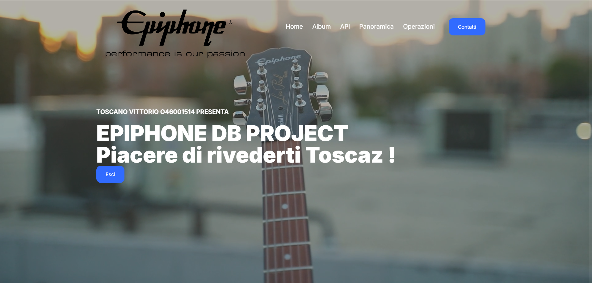
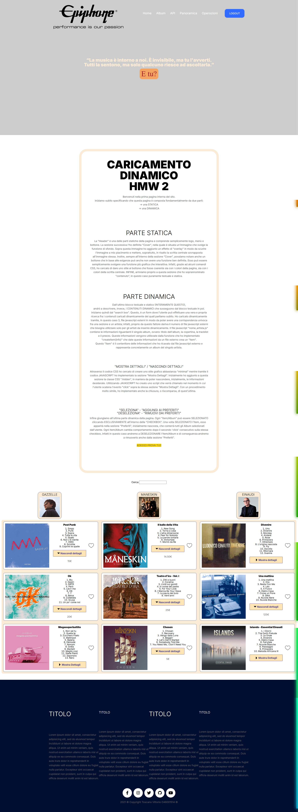
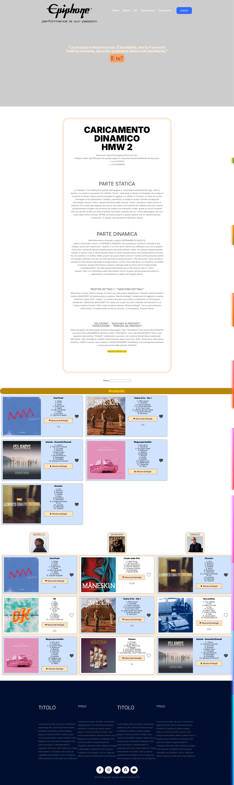
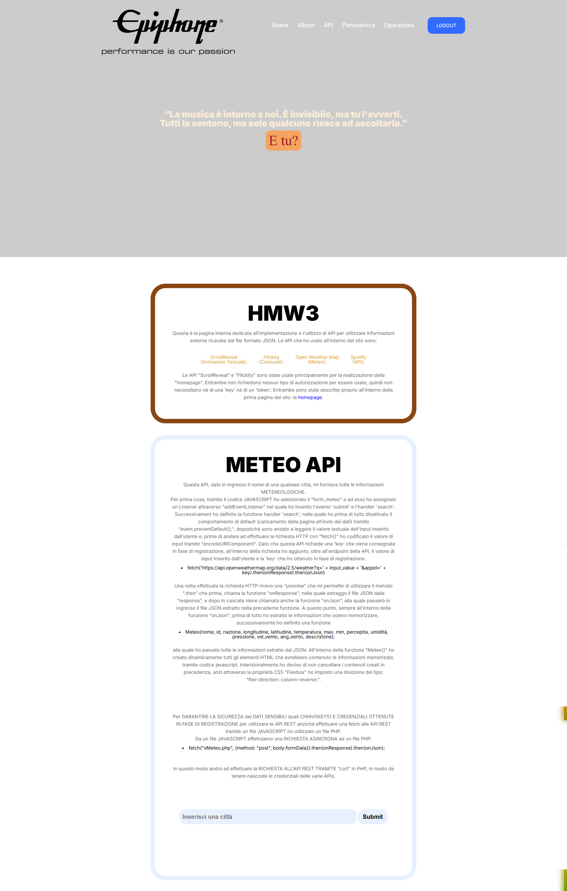
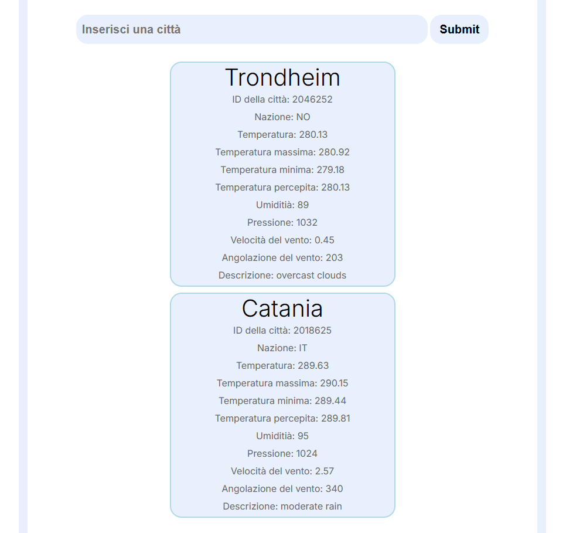
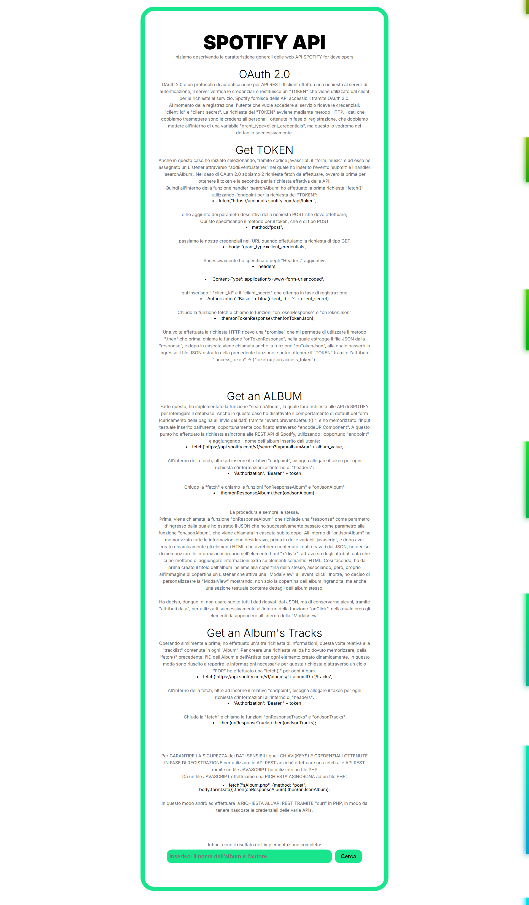
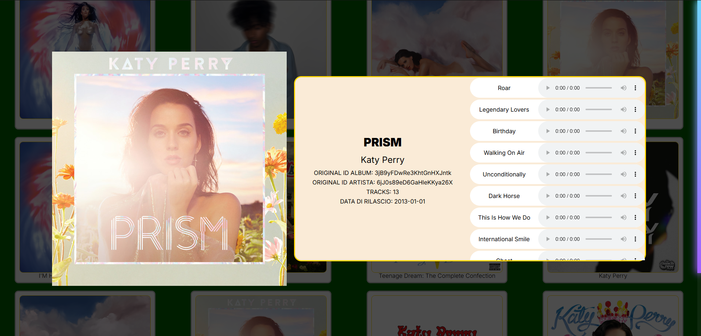

# EpiphoneDB 🎸

**EpiphoneDB** è un progetto web sviluppato durante il corso di Web Programming presso la Facoltà di Ingegneria Informatica dell'Università di Catania. Questo sito si propone come un'applicazione informativa e dinamica dedicata alla gestione di contenuti multimediali legati a album musicali, artisti e informazioni correlate.

## 🛠 Tecnologie Utilizzate
- **Frontend**: HTML5, CSS3, Flexbox per il layout, librerie come ScrollReveal per le animazioni.
- **Backend**: PHP per la gestione della logica e delle operazioni lato server.
- **Database**: MySQL per memorizzare utenti, album e altri contenuti; uso di SQL e tecniche di sicurezza contro SQL Injection.
- **API esterne**: integrazione con API per funzionalità aggiuntive (es. OpenWeatherMap per dati meteo, Spotify per informazioni sugli album).

## 🔒 Accesso e Autenticazione
Il sito è accessibile solo previa **registrazione**. Una volta creato un account, gli utenti possono accedere a tutti i contenuti tramite login, con sessione prolungata e gestione sicura dei dati tramite sessioni e cookie. Il progetto include file SQL per la configurazione in locale del database.

## 🌐 Pagine Principali e Funzionalità

### Homepage
La pagina principale introduce l’utente ai contenuti principali del sito, con sezioni statiche e dinamiche create per una visualizzazione modulare e personalizzabile.

- **Header e Cover** con video di background per un impatto visivo immediato.
- **Animazioni** in JavaScript tramite ScrollReveal per una maggiore dinamicità.
  
### Album
Pagina interattiva che consente di esplorare gli album tramite una ricerca dinamica:
- **Search Box** per trovare album specifici.
- **Dettagli degli Album**: mostra dettagli espandibili con animazioni e layout minimal.
- **Aggiunta ai Preferiti**: permette di selezionare album e aggiungerli alla propria lista.

### API
Integrazione con varie API per arricchire l’esperienza utente:
- **OpenWeatherMap** per visualizzare informazioni meteo.
- **Spotify API** per accedere ai dettagli degli album e ascoltare anteprime.

### Panoramica
Include funzionalità avanzate per utenti registrati, come la gestione delle sessioni:
- **Registrazione e Login**: controlli di validità e connessione sicura al database.
- **Protezione SQL Injection**: implementazione di tecniche di escape per sicurezza.
- **Logout e gestione dei cookie** per la protezione delle sessioni prolungate.

### Operazioni
Accesso ai dati dell'utente e contenuti aggiuntivi tramite query al database:
- **Visualizzazione utenti** registrati, album disponibili, partnership e negozi.
- **Query dinamiche** per ottenere informazioni specifiche tramite richieste asincrone.

## ⚙️ Configurazione e Setup
1. **Creazione del Database**: Carica i file SQL forniti nella repository per configurare il database locale.
2. **Schermate Dimostrative**: Se non desideri configurare il database, sono disponibili schermate del sito per dare un'anteprima delle funzionalità.

## 🖼️ Screenshot

Di seguito alcuni screenshot dimostrativi delle pagine e delle funzionalità principali del sito:

### HOMEPAGE

> La pagina principale, con un video di background e animazioni dinamiche.

### ALBUM

> Visualizzazione degli album, con dettagli espandibili e opzioni di selezione.

> Accesso ai contenuti protetti per utenti registrati, inclusi album preferiti e informazioni su artisti e partnership.

### API

> Dati meteo forniti tramite API di OpenWeatherMap.

> Informazioni sugli album e anteprime tramite Spotify API.

---

> **Nota**: Gli screenshot forniscono una panoramica visiva per chi non desidera configurare il database locale. Le immagini sono visualizzabili alla sezione `screenshots` della repository.

## 💡 Note Finali
EpiphoneDB è un progetto didattico mirato a esplorare tecniche avanzate di sviluppo web, interazioni dinamiche e gestione sicura dei dati utente.

---

**Grazie per aver visitato EpiphoneDB!** 🎶
